# SVGF: SVG Framework for PHP

**SVGF** (Scalable Vector Graphics Framework) is a PHP library for creating and modifying SVG files.

It is composed of: 
* A PHP implementation of the [Scalable Vector Graphics (SVG) 1.1](https://www.w3.org/TR/SVG/Overview.html) specification.
* A PHP implementation of the [Document Object Model (DOM) Level 2 Style Specification](https://www.w3.org/TR/DOM-Level-2-Style/).
* Additional functionality for the SVG element manipulation.

## Extended functionality

These are the main functionalities provided by **SVGF**:

* Read and write SVG files.
* Programatically modify the attributes of the elements in compliance with the (SVG) 1.1 specification.
* Programatically modify the style attribute in compliance with the (DOM) Level 2 Style Specification.
* Access SVG elements using XPath.
* Programatically align SVG elements
* Draw preset connectors between points and elements

## Usage

### Create SVG files

#### Create SVG with size A4 (portrait orientation)

```php
$dom_doc_svg = new \DOMDocument('1.0', 'utf-8');
$svg_svg = new SVGSVGElement($dom_doc_svg);
$svg_svg->setWidth('210mm');
$svg_svg->setHeight('297mm');
$svg_svg->setViewBox('0 0 210 270');
$svg_svg->setVersion('1.1');
$svg_svg->setAttribute('xmlns','http://www.w3.org/2000/svg');
```

#### Create SVG with size A4 using SVGF (portrait orientation)

```php
$dom_doc_svg = new \DOMDocument('1.0', 'utf-8');
$svg_svg = SVGFElement::svg($dom_doc_svg,'a4',SVGFElement::SIZE_A4,'portrait');
```

#### Create SVG with size A4 using SVGF (landscape orientation)

```php
$dom_doc_svg = new \DOMDocument('1.0', 'utf-8');
$svg_svg = SVGFElement::svg($dom_doc_svg,'a4');
```

or

```php
$dom_doc_svg = new \DOMDocument('1.0', 'utf-8');
$svg_svg = SVGFElement::svg($dom_doc_svg,'a4',SVGFElement::SIZE_A4,'landscape');
```

#### Create SVG with size Full HD

```php
$dom_doc_svg = new \DOMDocument('1.0', 'utf-8');
$svg_svg = new SVGSVGElement($dom_doc_svg);
$svg_svg->setWidth('1920px');
$svg_svg->setHeight('1080px');
$svg_svg->setViewBox('0 0 1920 1080');
$svg_svg->setVersion('1.1');
$svg_svg->setAttribute('xmlns','http://www.w3.org/2000/svg');	
```

#### Create SVG with size Full HD using SVGF 

```php
$dom_doc_svg = new \DOMDocument('1.0', 'utf-8');
$svg_svg = SVGFElement::svg($dom_doc_svg,'a4',SVGFElement::SIZE_FHD);
```

#### SVGF predefined sizes

* A0, A1, A2, A3, A4, A5
* ARCH_A, ARCH_B, ARCH_C, ARCH_D, ARCH_E
* ICON_16X16, ICON_32X32, ICON_48X48
* VGA, SVGA, XGA, HD, FHD, QHD, UHD, 8K

### Read existing SVG files

```php
$path_to_file = './file_name.svg';
$dom_doc_svg = SVGFImportFromSVG::getSVGFromFile($path_to_file);
```

### Create basic shapes

#### Create rectangle using methods

```php
$svg_rect = new SVGRectElement($dom_doc_svg);
$svg_rect->setId('rect_50x50_1');
$svg_rect->setX('0');
$svg_rect->setY('0');
$svg_rect->setWidth('50');
$svg_rect->setHeight('50');
$svg_rect->setRx('5');
$svg_rect->setRy('5');
$svg_svg->appendChild($svg_rect);
```


#### Create rectangle setting values

```php
$svg_rect = new SVGRectElement($dom_doc_svg);
$svg_rect->id = 'rect_50x50_2';
$svg_rect->x = '0';
$svg_rect->y = '0';
$svg_rect->width = '50';
$svg_rect->height = '50';
$svg_rect->rx = '10';
$svg_rect->ry = '10';
$svg_svg->appendChild($svg_rect);
```


#### Create rectangle using SVGF

```php
$svg_rect = SVGFElement::rect($dom_doc_svg,'50','50','rect_50x50_3');
$svg_svg->appendChild($svg_rect);
```


#### Create circle using methods

```php
$svg_circle = new SVGCircleElement($dom_doc_svg);
$svg_circle->setId('circle_10');
$svg_circle->setCx(25);
$svg_circle->setCy(25);
$svg_circle->setR(10);
$svg_svg->appendChild($svg_circle);
```


#### Create circle setting values

```php
$svg_circle = new SVGCircleElement($dom_doc_svg);
$svg_circle->id = 'circle_15';
$svg_circle->cx = 25;
$svg_circle->cy = 25;
$svg_circle->r = 15;
$svg_svg->appendChild($svg_circle);
```


#### Create circle using SVGF

```php
// create circle
$svg_circle = SVGFElement::circle($dom_doc_svg,'20','circle_20','25','25');
$svg_svg->appendChild($svg_circle);
```


### Apply style

#### Apply style setting individual properties

```php
$svg_circle = SVGFElement::circle($dom_doc_svg,10,'circle_10_style',25,25);
$svg_circle->style->setProperty('fill','#d9737a','');
$svg_circle->style->setProperty('stroke','#861a22','');
$svg_circle->style->setProperty('stroke-width','2','');
$svg_svg->appendChild($svg_circle);
```


#### Apply style setting style as string with properties and values

```php
$svg_circle = SVGFElement::circle($dom_doc_svg,15,'circle_15_style',25,25);
$svg_circle->style = "fill: #d9737a; stroke: #861a22; stroke-width: 2;";
$svg_svg->appendChild($svg_circle);
```


#### Apply style from SVGF

```php
$svg_circle = SVGFElement::circle($dom_doc_svg,20,'circle_20_style',25,25,'#d9737a','#861a22',2);
$svg_svg->appendChild($svg_circle);
```


### Align SVG elements

Source svg file used to illustrate align functionalities:

```xml
<?xml version="1.0" encoding="utf-8"?>
<svg xmlns="http://www.w3.org/2000/svg" width="150px" height="100px" viewBox="0 0 150 100" version="1.1">
	<rect width="50" height="50" x="50" y="25" id="rect_0" style="fill: #d9737a; "/>
	<rect width="30" height="30" x="15" y="35" id="rect_1" style="fill: #d9737a; stroke: #1a867e; stroke-width: 4; stroke-dasharray: 8 2; "/>
	<rect width="20" height="20" x="115" y="40" id="rect_2" style="fill: #861a22; "/>
</svg>
```

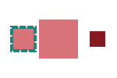

#### Align to center

```php
$svg_rect_1 = SVGFAlign::align($svg_rect_1,$svg_rect_0,SVGFObjectBox::ALIGN_CENTER);
$svg_rect_2 = SVGFAlign::align($svg_rect_2,$svg_rect_0,SVGFObjectBox::ALIGN_CENTER);
```


#### Align to center with offset

```php
$svg_rect_1 = SVGFAlign::align($svg_rect_1,$svg_rect_0,SVGFObjectBox::ALIGN_CENTER,20,0);
$svg_rect_2 = SVGFAlign::align($svg_rect_2,$svg_rect_0,SVGFObjectBox::ALIGN_CENTER,0,-10);
```

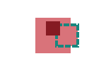

#### Align to sides

```php
$svg_rect_1 = SVGFAlign::align($svg_rect_1,$svg_rect_0,SVGFObjectBox::ALIGN_BOTTOM);
$svg_rect_2 = SVGFAlign::align($svg_rect_2,$svg_rect_0,SVGFObjectBox::ALIGN_RIGHT);
```

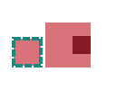

```php
$svg_rect_1 = SVGFAlign::align($svg_rect_1,$svg_rect_0,SVGFObjectBox::ALIGN_LEFT);
$svg_rect_2 = SVGFAlign::align($svg_rect_2,$svg_rect_0,SVGFObjectBox::ALIGN_TOP);
```

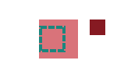

#### Position on sides

```php
$svg_rect_1 = SVGFAlign::align($svg_rect_1,$svg_rect_0,SVGFObjectBox::POSITION_LEFT);
$svg_rect_2 = SVGFAlign::align($svg_rect_2,$svg_rect_0,SVGFObjectBox::ALIGN_CENTER);
$svg_rect_2 = SVGFAlign::align($svg_rect_2,$svg_rect_0,SVGFObjectBox::POSITION_TOP);
```

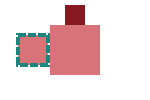

```php
$svg_rect_1 = SVGFAlign::align($svg_rect_1,$svg_rect_0,SVGFObjectBox::POSITION_RIGHT);
$svg_rect_2 = SVGFAlign::align($svg_rect_2,$svg_rect_0,SVGFObjectBox::POSITION_RIGHT);
$svg_rect_2 = SVGFAlign::align($svg_rect_2,$svg_rect_1,SVGFObjectBox::POSITION_BOTTOM);
```

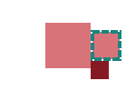

#### Position on sides with offset

```php
$svg_rect_1 = SVGFAlign::align($svg_rect_1,$svg_rect_0,SVGFObjectBox::POSITION_LEFT,-5);
$svg_rect_2 = SVGFAlign::align($svg_rect_2,$svg_rect_0,SVGFObjectBox::ALIGN_CENTER);
$svg_rect_2 = SVGFAlign::align($svg_rect_2,$svg_rect_0,SVGFObjectBox::POSITION_TOP,0,-5);
```

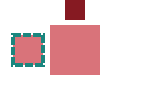

### Access SVG elements using XPath

Source svg file used to illustrate xpath functionalities:

```xml
<?xml version="1.0" encoding="utf-8"?>
<svg xmlns="http://www.w3.org/2000/svg" width="150px" height="100px" viewBox="0 0 150 100" version="1.1">
	<circle r="15" id="circle_2" cx="75" cy="25" style="fill: #861a22; "/>
	<g>
		<circle r="10" id="circle_1" cx="25" cy="25"/>
		<circle r="20" id="circle_3" cx="125" cy="25" style="fill: #d9737a; stroke: #861a22; stroke-width: 2; "/>
		<rect width="30" height="30" x="60" y="60" id="rect_2" style="fill: #861a22; "/>
	</g>
	<rect width="40" height="40" x="5" y="55" id="rect_1" style="fill: #d9737a; stroke: #861a22; stroke-width: 2; "/>
	<rect width="20" height="20" x="115" y="65" id="rect_3"/>
</svg>
```

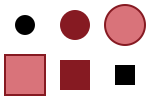

To get the DOM representation:

```php
$xpath = new \DOMXPath($dom_doc_svg);
```

#### Select elements by id

```php
// Change fill color of the elements rect_1 and circle_2 to #1a867e 
$matches = $xpath->query("//*[@id='rect_1'] | //*[@id='circle_2']");
foreach ($matches as $match) {
	$match->style->setProperty('fill','#1a867e','');
}
```

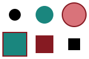

#### Select elements by tag name

```php
// Change fill color of circle elements to #1a867e. Move them 25px down and 20px to the right
$matches = $xpath->query("//circle");
foreach ($matches as $match) {
	$match->style->setProperty('fill','#1a867e','');
	$match->cy = $match->cy + 25;
	$match->cx = $match->cx + 20;
}
```

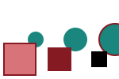

#### Select children elements

```php
// Change fill color of the g children elements to #1a867e
$matches = $xpath->query("//g/*");
foreach ($matches as $match) {
	$match->style->setProperty('fill','#1a867e','');
}
```

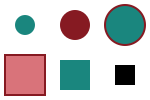

#### Select elements by attribute value

```php
// Create a corner radius of 15px in rect_1
$matches = $xpath->query("//rect[@id='rect_1']");
foreach ($matches as $match) {
	$match->rx = 15;
	$match->ry = 15;	
}

// Create a corner radius of 5px in rect_2
$matches = $xpath->query("//rect[@id='rect_2']");
foreach ($matches as $match) {
	$match->rx = 5;
	$match->ry = 5;
}

// Change fill color of rect elements with rx < 10 (or not set) to #1a867e.
$matches = $xpath->query("//rect[@rx<10] | rect[not(@rx)]");
foreach ($matches as $match) {
	$match->style->setProperty('fill','#1a867e','');
}
```


#### Select elements by style setting

```php
// Create border for elements with fill #861a22.
$matches = $xpath->query("//*");
foreach ($matches as $match) {
	$fill = $match->style->getPropertyValue('fill');
	if ($fill == '#861a22') {
		$match->style->setProperty('stroke','#1a867e','');
		$match->style->setProperty('stroke-width',5,'');
	}
}
```

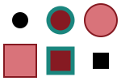

#### Select parent element

```php
// Create style for parent of rect_2 (the style settings will be overriden if they are definied in the child element).
$matches = $xpath->query("//rect[@id='rect_2']");
foreach ($matches as $match) {
	$parent_svg = $match->parentNode;
	$parent_svg->style = 'stroke:#d9737a; stroke-width: 5; stroke-dasharray: 10 5; fill:#1a867e';
}
```

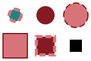

### Create texts

#### Create text

```php
$svg_text = new SVGTextElement($dom_doc_svg);
$svg_text->nodeValue = 'Hello World!';
$svg_text->id = 'text_hello';
$svg_text->x = 0;
$svg_text->y = 20;
$svg_svg->appendChild($svg_text);
```


#### Create text using SVGF

```php
$svg_text = SVGFElement::text($dom_doc_svg,'Hello World!','text_hello','0','20');
$svg_svg->appendChild($svg_text);
```


#### Create text with style properties

```php
$svg_text = new SVGTextElement($dom_doc_svg);
$svg_text->nodeValue = 'Hello World!';
$svg_text->id = 'text_hello';
$svg_text->x = 0;
$svg_text->y = 20;
$svg_text->style->setProperty('font-family','Helvetica','');
$svg_text->style->setProperty('font-size','16px','');
$svg_text->style->setProperty('font-weight','bold','');
$svg_text->style->setProperty('fill','#d9737a','');
$svg_svg->appendChild($svg_text);
```


#### Create text with style properties using SVGF

```php
$svg_text = SVGFElement::text($dom_doc_svg,'Hello World!','text_hello','0','20','Helvetica','25px','normal','#861a22');
$svg_svg->appendChild($svg_text);
```


### Align texts using SVGF

**Note**: The file containing the TrueType font must be located in the same folder

#### Align texts to edges of element

```php
$svg_text_0 = SVGFAlign::align($svg_text_0,$svg_rect,SVGFObjectBox::ALIGN_CENTER); // 'CENTERED' 10px
$svg_text_1 = SVGFAlign::align($svg_text_1,$svg_rect,SVGFObjectBox::ALIGN_LEFT); // 'On top and left aligned' 16px
$svg_text_1 = SVGFAlign::align($svg_text_1,$svg_rect,SVGFObjectBox::POSITION_TOP);
$svg_text_2 = SVGFAlign::align($svg_text_2,$svg_rect,SVGFObjectBox::ALIGN_RIGHT); // 'Aligned with bottom-right corner' 10px
$svg_text_2 = SVGFAlign::align($svg_text_2,$svg_rect,SVGFObjectBox::ALIGN_BOTTOM);
$svg_text_3 = SVGFAlign::align($svg_text_3,$svg_rect,SVGFObjectBox::POSITION_BOTTOM); // 'Below and to the right' 14px
$svg_text_3 = SVGFAlign::align($svg_text_3,$svg_rect,SVGFObjectBox::POSITION_RIGHT);
$svg_text_4 = SVGFAlign::align($svg_text_4,$svg_rect,SVGFObjectBox::POSITION_LEFT); // 'To the left' 24px (y=50)
```

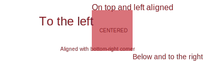

#### Align texts with offset

```php
$svg_text_0 = SVGFAlign::align($svg_text_0,$svg_rect,SVGFObjectBox::ALIGN_CENTER); // 'offset top' 8px
$svg_text_0 = SVGFAlign::align($svg_text_0,$svg_rect,SVGFObjectBox::POSITION_TOP,0,-10);
$svg_text_1 = SVGFAlign::align($svg_text_1,$svg_rect,SVGFObjectBox::ALIGN_CENTER); // 'offset right' 16px
$svg_text_1 = SVGFAlign::align($svg_text_1,$svg_rect,SVGFObjectBox::POSITION_RIGHT,20);
$svg_text_2 = SVGFAlign::align($svg_text_2,$svg_rect,SVGFObjectBox::ALIGN_CENTER,-5,20); // 'offset center' 10px
```

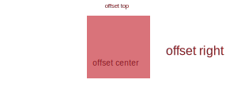

### Draw connectors

Source php code to create the markers used to illustrate connectors:

```php
// create defs
$svg_defs = SVGFElement::defs($dom_doc_svg,'marker');

// create markers
$svg_marker_arrow_start = SVGFMarker::markerArrowStart($dom_doc_svg,'marker_arrow_start','path_arrow_start','#861a22');
$svg_marker_arrow_end = SVGFMarker::markerArrowEnd($dom_doc_svg,'marker_arrow_end','path_arrow_end','#861a22');
$svg_marker_cicrle = SVGFMarker::markerCircle($dom_doc_svg,'marker_circle','circle','#861a22');

$svg_defs->appendChild($svg_marker_arrow_start);
$svg_defs->appendChild($svg_marker_arrow_end);
$svg_defs->appendChild($svg_marker_cicrle);

$svg_svg->appendChild($svg_defs);
```

#### Draw connectors between points

```php
// create points
$point_start_1 = SVGFElement::point(10,10);
$point_end_1 = SVGFElement::point(40,40);

$point_start_2 = SVGFElement::point(60,40);
$point_end_2 = SVGFElement::point(90,10);

$point_start_3 = SVGFElement::point(125,40);
$point_end_3 = SVGFElement::point(125,10);

$point_start_4 = SVGFElement::point(160,25);
$point_end_4 = SVGFElement::point(190,25);

// create connectors
$svg_connector_1 = SVGFConnector::points($dom_doc_svg,$point_start_1,$point_end_1,'#861a22','1px','connector_1','marker_circle','marker_arrow_end');
$svg_connector_2 = SVGFConnector::points($dom_doc_svg,$point_start_2,$point_end_2,'#861a22','1px','connector_2','marker_arrow_start','marker_arrow_end');
$svg_connector_3 = SVGFConnector::points($dom_doc_svg,$point_start_3,$point_end_3,'#861a22','1px','connector_3','marker_arrow_end','marker_arrow_end');
$svg_connector_4 = SVGFConnector::points($dom_doc_svg,$point_start_4,$point_end_4,'#861a22','1px','connector_4',null,'marker_circle');
```


#### Draw connectors of different stroke widths between points

The marker size will automatically adjust to the stroke size of the path

```php
$svg_connector_1 = SVGFConnector::points($dom_doc_svg,$point_start_1,$point_end_1,'#861a22','0.5px','connector_1','marker_circle','marker_arrow_end');
$svg_connector_2 = SVGFConnector::points($dom_doc_svg,$point_start_2,$point_end_2,'#861a22','2px','connector_2','marker_arrow_start','marker_arrow_end');
$svg_connector_3 = SVGFConnector::points($dom_doc_svg,$point_start_3,$point_end_3,'#861a22','1.5px','connector_3','marker_arrow_end','marker_arrow_end');
$svg_connector_4 = SVGFConnector::points($dom_doc_svg,$point_start_4,$point_end_4,'#861a22','3px','connector_4',null,'marker_circle');
```

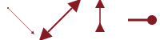

#### Draw connectors between element centers

```php
$svg_connector_1 = SVGFConnector::centers($dom_doc_svg,$svg_circle,$svg_rect,'#861a22','1px','connector_1',null,'marker_arrow_end');
$svg_connector_2 = SVGFConnector::centers($dom_doc_svg,$svg_rect,$svg_text,'#861a22','1px','connector_2',null,'marker_arrow_end');
```

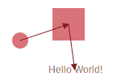

#### Draw connectors between elements borders

```php
$svg_connector_1 = SVGFConnector::borders($dom_doc_svg,$svg_rect_left,$svg_rect_top,'#861a22','1px','connector_1',null,'marker_arrow_end');
$svg_connector_2 = SVGFConnector::borders($dom_doc_svg,$svg_rect_right,$svg_rect_left,'#861a22','1px','connector_2',null,'marker_arrow_end');
$svg_connector_3 = SVGFConnector::borders($dom_doc_svg,$svg_circle,$svg_rect_right,'#861a22','1px','connector_3',null,'marker_arrow_end');
$svg_connector_4 = SVGFConnector::borders($dom_doc_svg,$svg_rect_top,$svg_circle,'#861a22','1px','connector_5',null,'marker_arrow_end');
$svg_connector_5 = SVGFConnector::borders($dom_doc_svg,$svg_text,$svg_rect_top,'#861a22','1px','connector_6',null,'marker_arrow_end');
$svg_connector_6 = SVGFConnector::borders($dom_doc_svg,$svg_circle,$svg_text,'#861a22','1px','connector_8',null,'marker_arrow_end');
```

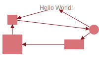

#### Draw connectors between elements borders with offset

```php
$svg_connector_1 = SVGFConnector::borders($dom_doc_svg,$svg_rect_left,$svg_rect_top,'#861a22','1px','connector_1',null,'marker_arrow_end',-5);
$svg_connector_2 = SVGFConnector::borders($dom_doc_svg,$svg_rect_right,$svg_rect_left,'#861a22','1px','connector_2',null,'marker_arrow_end',15);
$svg_connector_3 = SVGFConnector::borders($dom_doc_svg,$svg_circle,$svg_rect_right,'#861a22','1px','connector_3',null,'marker_arrow_end',-5);
$svg_connector_4 = SVGFConnector::borders($dom_doc_svg,$svg_rect_top,$svg_circle,'#861a22','1px','connector_5',null,'marker_arrow_end',15);
$svg_connector_5 = SVGFConnector::borders($dom_doc_svg,$svg_text,$svg_rect_top,'#861a22','1px','connector_6',null,'marker_arrow_end',5);
$svg_connector_6 = SVGFConnector::borders($dom_doc_svg,$svg_circle,$svg_text,'#861a22','1px','connector_8',null,'marker_arrow_end',5);
```

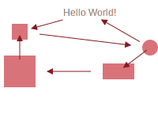

#### Draw connectors between elements sides

```php
$svg_connector_1 = SVGFConnector::sides($dom_doc_svg,$svg_rect_left_bottom,$svg_rect_left,'connector_1','#861a22');
$svg_connector_2 = SVGFConnector::sides($dom_doc_svg,$svg_rect_left_top,$svg_rect_left_bottom,'connector_2','#861a22');
$svg_connector_3 = SVGFConnector::sides($dom_doc_svg,$svg_rect_right_bottom,$svg_rect_right_top,'connector_3','#861a22');
```

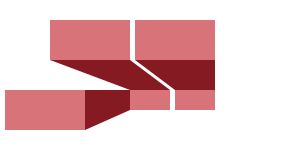

#### Draw connectors between elements sides with offset

```php
$svg_connector_1 = SVGFConnector::sides($dom_doc_svg,$svg_rect_left_bottom,$svg_rect_left,'connector_1','#861a22',2);
$svg_connector_2 = SVGFConnector::sides($dom_doc_svg,$svg_rect_left_top,$svg_rect_left_bottom,'connector_2','#861a22',2);
$svg_connector_3 = SVGFConnector::sides($dom_doc_svg,$svg_rect_right_bottom,$svg_rect_right_top,'connector_3','#861a22',2);
```


#### Draw connectors between text sides with offset

```php
$svg_connector_1 = SVGFConnector::sides($dom_doc_svg,$svg_text_left_top,$svg_text_left_middle,'connector_1','#d9737a',2);
$svg_connector_2 = SVGFConnector::sides($dom_doc_svg,$svg_text_left_middle,$svg_text_left_bottom,'connector_2','#d9737a',2);
$svg_connector_3 = SVGFConnector::sides($dom_doc_svg,$svg_text_right_top,$svg_text_right_middle,'connector_3','#d9737a',2);
$svg_connector_4 = SVGFConnector::sides($dom_doc_svg,$svg_text_right_middle,$svg_text_right_bottom,'connector_4','#d9737a',2);
```

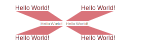